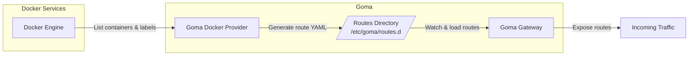

# Goma Docker Provider

The **Goma Docker Provider** is a dynamic configuration provider for **Goma Gateway**.
It automatically discovers Docker containers via labels and generates **Goma Gateway route configurations** without manual YAML editing.

It’s ideal for **Docker-based** and **Docker Compose** deployments where services should self-register routes declaratively.

---

## How It Works

The provider:

* Scans running containers for the label `goma.enable=true`
* Converts container labels into **Goma Gateway routes**
* Writes the generated routes to a YAML file
* Supports **single-route** and **multi-route** containers
* Periodically polls Docker to keep routes in sync

## Startup Flow & Configuration Sync

This diagram shows how **Goma Gateway**, **Goma Docker Provider**, and **Docker services** interact at runtime.

### Startup Flow Diagram



## Links

- **Gateway**: [Goma Gateway on GitHub](https://github.com/jkaninda/goma-gateway)
- **Source Code**: [goma-docker-provider](https://github.com/jkaninda/goma-docker-provider)
- **Docker Image**: [jkaninda/goma-docker-provider](https://hub.docker.com/r/jkaninda/goma-docker-provider)
---

### Defaults

| Setting          | Default                   |
| ---------------- | ------------------------- |
| Output file      | `goma-docker-routes.yaml` |
| Output directory | `/etc/goma/routes.d`      |
| Poll interval    | `10s`                     |

All defaults can be overridden via environment variables.

---

## Single-Route Configuration (Basic)

A container exposing **one route** can use flat `goma.*` labels.

```yaml
services:
  api-service:
    image: your-api:latest
    labels:
      # Core
      - "goma.enable=true"
      - "goma.name=api"
      - "goma.path=/api"
      - "goma.port=8000"
      - "goma.rewrite=/"          # Rewrite /api → /
      - "goma.priority=100"

      # Hosts & Methods
      - "goma.hosts=api.example.com,api.local"
      - "goma.methods=GET,POST,PUT,DELETE"

      # Health Check
      - "goma.health_check.path=/health"
      - "goma.health_check.interval=30s"
      - "goma.health_check.timeout=5s"
      - "goma.health_check.healthy_statuses=200,204"

      # Security
      - "goma.security.forward_host_headers=true"
      - "goma.security.enable_exploit_protection=true"
      - "goma.security.tls.insecure_skip_verify=false"

      # Features
      - "goma.middlewares=jwt-auth,rate-limit"
      - "goma.disable_metrics=false"
```

---

## Multi-Route Configuration

If a container exposes **multiple ports or paths**, use the `goma.routes.{routeName}.*` pattern.

```yaml
services:
  multi-service:
    image: your-service:latest
    labels:
      - "goma.enable=true"

      # Route: API
      - "goma.routes.api.path=/api"
      - "goma.routes.api.port=8000"
      - "goma.routes.api.methods=GET,POST,PUT,DELETE"
      - "goma.routes.api.health_check.path=/health"
      - "goma.routes.api.health_check.interval=30s"
      - "goma.routes.api.security.forward_host_headers=true"

      # Route: Metrics
      - "goma.routes.metrics.path=/metrics"
      - "goma.routes.metrics.port=9090"
      - "goma.routes.metrics.methods=GET"
      - "goma.routes.metrics.disable_metrics=true"

      # Route: Admin
      - "goma.routes.admin.path=/admin"
      - "goma.routes.admin.port=8081"
      - "goma.routes.admin.hosts=admin.example.com"
      - "goma.routes.admin.security.enable_exploit_protection=true"
      - "goma.routes.admin.security.tls.insecure_skip_verify=false"
```

---

## Docker Labels Reference

### Core Route Labels

| Label           | Description            | Example |
| --------------- | ---------------------- | ------- |
| `goma.enable`   | Enable route discovery | `true`  |
| `goma.name`     | Route name             | `api`   |
| `goma.path`     | Public route path      | `/api`  |
| `goma.port`     | Container port         | `8080`  |
| `goma.rewrite`  | Rewrite path           | `/`     |
| `goma.priority` | Route priority         | `100`   |
| `goma.enabled`  | Enable/disable route   | `true`  |

---

### Hosts & Methods

| Label          | Description          |
| -------------- | -------------------- |
| `goma.hosts`   | Allowed hostnames    |
| `goma.methods` | Allowed HTTP methods |

---

### Health Check

| Label                                | Description         |
| ------------------------------------ | ------------------- |
| `goma.health_check.path`             | Health endpoint     |
| `goma.health_check.interval`         | Check interval      |
| `goma.health_check.timeout`          | Timeout             |
| `goma.health_check.healthy_statuses` | Valid HTTP statuses |

---

### Security

| Label                                     | Description                  |
| ----------------------------------------- | ---------------------------- |
| `goma.security.forward_host_headers`      | Forward original Host header |
| `goma.security.enable_exploit_protection` | Enable exploit protection    |
| `goma.security.tls.insecure_skip_verify`  | Skip TLS verification        |

---

### Features & Observability

| Label                  | Description               |
| ---------------------- | ------------------------- |
| `goma.middlewares`     | Attached middlewares      |
| `goma.disable_metrics` | Disable metrics for route |

---

### Multi-Route Pattern

| Pattern                             | Description      |
| ----------------------------------- | ---------------- |
| `goma.routes.{name}.path`           | Route path       |
| `goma.routes.{name}.port`           | Route port       |
| `goma.routes.{name}.methods`        | Allowed methods  |
| `goma.routes.{name}.hosts`          | Hosts            |
| `goma.routes.{name}.health_check.*` | Health check     |
| `goma.routes.{name}.security.*`     | Security options |

---

## Environment Variables

| Variable             | Description                 | Default              |
| -------------------- | --------------------------- | -------------------- |
| `GOMA_OUTPUT_DIR`    | Output directory for routes | `/etc/goma/routes.d` |
| `GOMA_POLL_INTERVAL` | Docker polling interval     | `10s`                |
| `GOMA_ENABLE_SWARM`  | Enable Docker Swarm mode    | `false`              |

---

## Example Deployment

### 1. Goma Gateway Configuration

Create `goma.yml`:

```yaml
version: "2"

gateway:
  entryPoints:
    web:
      address: ":80"
    webSecure:
      address: ":443"

  log:
    level: info
  providers:
    file:
      enabled: true
      directory: /etc/goma/routes.d
      watch: true
  monitoring:
    enableMetrics: true
    enableLiveness: true

  # extraConfig:
  #   directory: /etc/goma/extra
  #   watch: true

  routes: []

middlewares:
  - name: basic-auth
    type: basicAuth
    paths: ["/.*"]
    rule:
      realm: Restricted
      users:
        - username: admin
          password: $2y$05$TIx7l8sJWvMFXw4n0GbkQuOhemPQOormacQC4W1p28TOVzJtx.XpO

certManager:
  provider: acme
```

---

### 2. Docker Compose

```yaml
services:
  goma-gateway:
    image: jkaninda/goma-gateway:latest
    ports:
      - "80:80"
      - "443:443"
    volumes:
      - ./config:/etc/goma
    networks: [goma-net]

  goma-docker-provider:
    image: jkaninda/goma-docker-provider
    volumes:
      - /var/run/docker.sock:/var/run/docker.sock:ro
      - ./config/routes.d:/etc/goma/routes.d
    environment:
      - GOMA_OUTPUT_DIR=/etc/goma/routes.d
      - GOMA_POLL_INTERVAL=10s
      - GOMA_ENABLE_SWARM=false
  web-service:
    image: jkaninda/okapi-example
    labels:
      - "goma.enable=true"
      - "goma.port=8080"
      - "goma.hosts=example.com, www.example.com"
    networks:
      - goma-net
    networks: [goma-net]
```


## Required Goma Gateway Configuration

The Goma Docker Provider **only generates route files**.
For these routes to be **loaded and applied**, **Goma Gateway must be configured to read and watch the generated directory**.

You must configure **ONE (and only one)** of the following options:

* **Extra Config** (simple, legacy-compatible)
* **File Provider** (recommended)

### Option 1: Extra Config (Simple)

Use this option if you want a minimal setup.

```yaml
extraConfig:
  directory: /etc/goma/routes.d
  watch: true
```


### Option 2: File Provider (Recommended)

This is the **preferred approach**, especially when using multiple providers.

```yaml
providers:
  file:
    enabled: true
    directory: /etc/goma/routes.d
    watch: true
```

---

## License

MIT License — free to use, modify, and distribute.

---

## © Copyright

© 2026 — **Jonas Kaninda**

